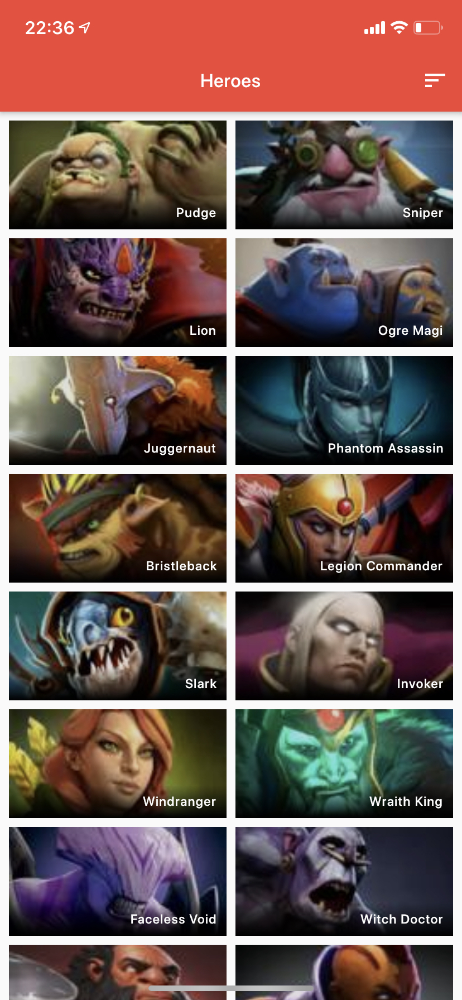
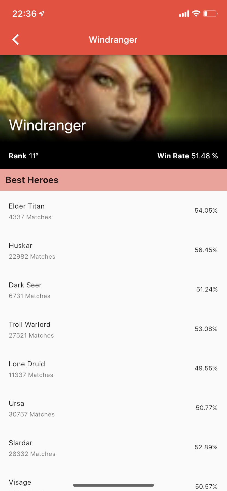
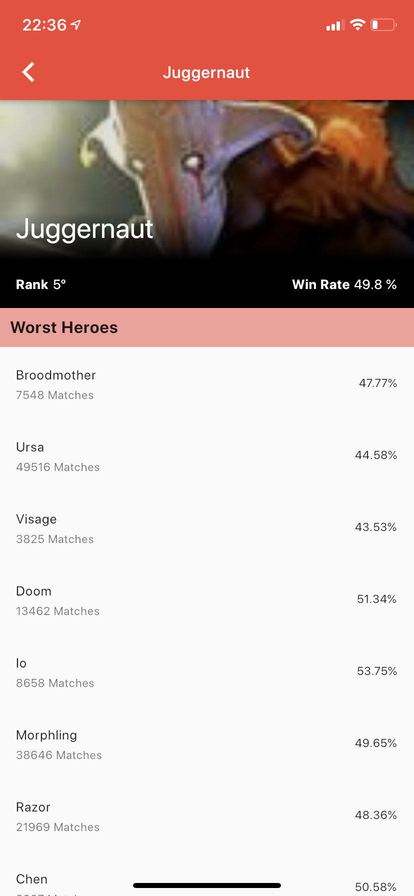

# Dota 2 App using React Native, Firebase and Google Cloud

This is a pet project that born with the idea of having a nice subject to go through some Live Coding sessions by @alvaroviebrantz. We are getting data from [DotaBuff](https://dotabuff.com) website to have more info about the heroes and latest matches.



That info is going to be used on the app to build different features, some of them are :

* Show which heroes are good/bad against a given hero.
* Show a rank of best heroes
* Build both match teams and get recommendations while heroes are being picked.

Also we are going to build a Voice integration that will allow to access some of those same features from the app.

The live codings session happens in Portuguese (PT-BR) and you can follow on my Youtube/Twitch channels.

* [Alvaro Viebrantz on Youtube](https://youtube.com/alvaroviebrantz)
* [Alvaro Viebrantz on Twitch](https://twitch.tv/alvaroviebrantz)

> Gcloud functions and firebase database are in the repository of [@alvaroviebrantz](https://github.com/alvarowolfx/gcloud-dota-app)

# Table of Contents

- [Dota 2 App using React Native, Firebase and Google Cloud](#dota-2-app-using-react-native-firebase-and-google-cloud)
- [Table of Contents](#table-of-contents)
- [Getting Started](#getting-started)
  - [Node Setup](#node-setup)
  - [Mobile Setup](#mobile-setup)
  - [Building & Running the project](#building--running-the-project)

# Getting Started

## Node Setup

* Install the latest LTS version of [Node.js](https://nodejs.org/) (which includes npm). An easy way to do so is with `nvm`. (Mac and Linux: [here](https://github.com/creationix/nvm), Windows: [here](https://github.com/coreybutler/nvm-windows))

```shell
nvm install --lts
```

## Mobile Setup

* Follow the guide on their [website](https://reactnative.dev/docs/environment-setup).
* Run the following command to make sure it's all good.
```shell
npx react-native doctor
```

## Building & Running the project

* Install dependencies of `package.json` (npm install).
* To run the app, run `npx react-native run-android` or `npx react-native run-ios`.

> Don't forget to get google-services.json from firebase project and add on `android/app` folder. 
